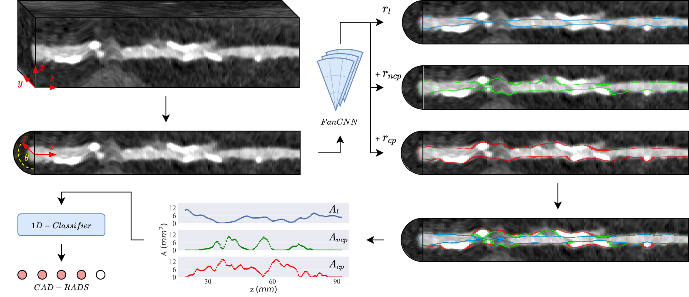

# FanCNN for plaque quantification
Code for the paper _Automatic Coronary Artery Plaque Quantification and CAD-RADS Prediction using Mesh Priors_, van Herten et al. 2023, IEEE Transactions on Medical Imaging (IEE-TMI) ([link to the paper](https://ieeexplore.ieee.org/abstract/document/10288599), [arXiv](https://arxiv.org/abs/2310.11297)).

This code uses coronary artery centerline priors to create mesh segmentations of the coronary artery lumen, as well as calcified and non-calcified plaque. The mesh segmentations are used to compute plaque volumes and to predict the CAD-RADS score.

# Optimization
The method optimizes the locations of vertices describing the mesh segmentations for the lumen, calcified and non-calcified plaque through a 3D-CNN operating on polar-transformed multi-planar reformatted images. Meshes are subsequently used to generate signals for lumen and plaque area measures along the coronary artery centerline, which are processed by a 1D-CNN to predict the CAD-RADS score.

# Reference
If you use this code, please cite the accompanying paper:

    @article{vanherten2023automatic,
      title={Automatic Coronary Artery Plaque Quantification and CAD-RADS Prediction using Mesh Priors},
      author={Van Herten, Rudolf LM and Hampe, Nils and Takx, Richard AP and Franssen, Klaas Jan and Wang, Yining and Such{\'a}, Dominika and Henriques, Jos{\'e} P and Leiner, Tim and Planken, R Nils and I{\v{s}}gum, Ivana},
      journal={IEEE Transactions on Medical Imaging},
      year={2023},
      publisher={IEEE}
    }